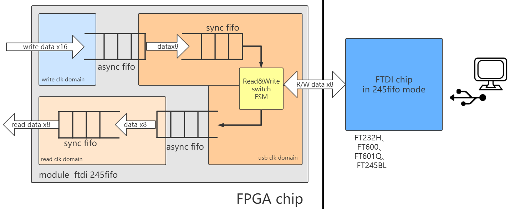

-CAD09D.svg)   

FTDI 245fifo controller
===========================
[FT232H](https://ftdichip.com/Products/ICs/FT232H.htm)、[FT2232H](https://ftdichip.com/Products/ICs/FT2232H.htm)、[FT600](https://ftdichip.com/Products/ICs/FT600.html) 等芯片的 **sync-245-fifo 模式** 控制器，实现 FPGA 与 Host-PC 的高速通信。

# 简介

**sync-245-fifo** 是 **FTDI 公司 USB 系列芯片**的最高速传输模式。该库将 **245fifo 控制器** 封装成 **Verilog模块** ，留出**精简流式收发接口** ，方便 Verilog 开发者调用。

另外，本库提供配套的 FPGA 示例工程、驱动安装教程、Python 软件库安装教程，并提供几个 Python 程序用于测试。

下图是该模块的结构框图。

|      |
| :--------------------------: |
| 图：ftdi_245fifo.sv 结构框图 |

## 特点

* **收发调度**：FTDI 芯片与 FPGA 之间的接口是半双工的，该模块调度收发分时复用，实现 **收发接口互相独立** 。
* **跨时钟域**：FTDI 芯片有自己的时钟。该模块用异步 FIFO 实现时钟域转换，使得收发接口可使用 **自定义时钟** 。
* **位宽变换**：FTDI 芯片数据位宽是固定的，但本模块实现了位宽变换。收发接口的 **位宽可自定义** 。

## 性能测试结果

以下是用本库测出来的 USB 上行（FPGA发，Host-PC收）的带宽。

| 芯片型号    | FT232H / FT2232H\*  |  FT600     | FT601      |
| :--------: | :------------:     |   :------:    | :--------: |
| **USB模式** | USB2.0 HS          |  USB3.0 SS     | USB3.0 SS  |
| **理论带宽** | <60MBps             |  <200MBps      | <400MBps  |
| **实测带宽** | 42MBps           |  120MBps       | 可用，未测 |

> \* [FT232H](https://ftdichip.com/Products/ICs/FT232H.htm) 与 [FT2232H](https://ftdichip.com/Products/ICs/FT2232H.htm) 高度相似， FT2232H 的 **channel A** 可配置成与 FT232H 完全相同的 **sync-245-fifo 接口** 。因此本库的FT232H示例也适用于FT2232H

# 模块使用方法

本库的设计代码是 RTL 目录中的 ftdi_245fifo.sv，供 FPGA 开发者调用来开发自己的 USB 通信业务，它的接口和参数如下图：

|        |
| :------------------------: |
| 图：ftdi_245fifo.sv 的接口 |

## 模块 parameter

要调用本模块，首先要根据实际情况确定各个 parameter 的值，如下表：

| parameter | 说明                                                         |
| --------- | ------------------------------------------------------------ |
| TX_DEXP   | 决定了用户发送接口的数据宽度（即tx_data的宽度）：0对应8bit宽，1对应16bit宽，2对应32bit宽，3对应64bit宽，以此类推。可以根据实际需要任意设置，不受所选的 USB 芯片型号限制。 |
| TX_AEXP   | 决定了用户发送缓存的深度，深度=2^TX_AEXP。默认为10（即默认深度为1024），如果 FPGA BRAM 较大，该项可以设得更大，来提高突发性能。 |
| RX_DEXP   | 决定了用户接收接口的数据宽度（即rx_data的宽度）：0对应8bit宽，1对应16bit宽，2对应32bit宽，3对应64bit宽，以此类推。可以根据实际需要任意设置，不受所选的 USB 芯片型号限制。 |
| RX_AEXP   | 决定了用户接收缓存的深度，深度=2^RX_AEXP。默认为10（即默认深度为1024），如果 FPGA BRAM 较大，该项可以设得更大，来提高突发性能。 |
| C_DEXP    | 决定了USB数据信号（即usb_data）的宽度：0对应8bit宽，1对应16bit宽，2对应32bit宽，3对应64bit宽。应该根据所选的 USB 芯片型号而设置：FT232H设为0，FT600设为1，FT601设为2。 |

## 连接到 FTDI USB 芯片

usb_rxf, usb_txe, usb_oe, usb_rd, usb_wr, usb_data, usb_be 这些信号应约束到 FPGA 的引脚上，连接到 FTDI USB 芯片的管脚上。注意以下几点：

* FTDI USB 芯片工作在 **sync-245-fifo 模式** 时，引脚名称见芯片 Datasheet，以 FT232H 为例，见 [FT232H DataSheet](https://www.ftdichip.com/Support/Documents/DataSheets/ICs/DS_FT232H.pdf) 第9页。
* usb_be 信号是字节独热码，仅 FT600 和 FT601 芯片有这个信号，使用其它芯片时请忽略。
* 这些引脚的时序由模块维护，不需要你关注。如果你感兴趣，见芯片 Datasheet，例如 [FT232H DataSheet](https://www.ftdichip.com/Support/Documents/DataSheets/ICs/DS_FT232H.pdf) 第23页

## 用户发送接口

本模块内置一个发送缓存，开发者需要提供一个 tx_clk 时钟，并在该时钟域下操作 tx_valid, tx_ready, tx_data 这三个信号，来把数据从 FPGA 发送到发送缓存，（Host-PC上启动接收程序时，发送缓存中的数据会自动发给PC）。注意以下几点：

* tx_clk 的频率不限，tx_valid, tx_ready, tx_data 信号应该在 tx_clk 上升沿更新或捕获。
* tx_valid (请求) 为 1 时，说明用户想发送一个数据到模块内部的发送缓存。同时，tx_data 应产生有效数据。
* tx_ready (允许) 为 1 时，说明模块已经准备好接收发送数据。tx_ready=0 时，模块的发送缓存暂时满，不能接收更多数据。
* tx_valid 与 tx_ready 是一对握手信号。二者同时为 1 时， tx_data 写入缓存成功。
* 与 AXI-stream 相比，这里没有 tlast 信号，因此用户发送接口没有包的概念，是单纯的流。

发送接口如下时序图，它通过用户接口发送了3个数据：D1,D2,D3。其中：

* 第 1, 2 周期，用户令 tx_valid=0 ，因此暂时空闲没发数据。

* 第 3 周期，用户要发 D1，因此令 tx_valid=1，本周期 tx_ready=1 ，说明 D1 即刻发送成功。

* 第 4, 5, 6, 7 周期，用户要发 D2，因此令 tx_valid=1，但第 4, 5, 6 周期 tx_ready=0 导致发送暂时失败，直到第 7 周期 tx_ready=1 时，才发送成功。

* 第 8, 9 周期，用户令 tx_valid=0 ，因此暂时空闲没发数据。

* 第 10 周期，用户要发 D3，因此令 tx_valid=1，本周期 tx_ready=1 ，说明 D3 即刻发送成功。

      cycle       1     2     3     4     5     6     7     8     9     10    11
                _    __    __    __    __    __    __    __    __    __    __    __
       clk       \__/  \__/  \__/  \__/  \__/  \__/  \__/  \__/  \__/  \__/  \__/  \
                            _____________________________             _____
      tx_valid  ___________/                             \___________/     \________
                _________________                   ________________________________
      tx_ready                   \_________________/
                            _____ _______________________             _____
      tx_data   XXXXXXXXXXXX__D1_X___________D2__________XXXXXXXXXXXXX__D3_XXXXXXXXX

## 用户接收接口

本模块内置一个接收缓存，开发者需要提供一个 rx_clk 时钟，并在该时钟域下操作 rx_valid, rx_ready, rx_data 这三个信号，来把来自 Host-PC 的暂存在接收缓存内的数据拿出来。它与用户发送接口时序相同，但方向相反。注意以下几点：

* rx_clk 的频率不限，而且当然可以和 tx_clk 接在同一个时钟上，rx_valid, rx_ready, rx_data 信号应该在 rx_clk 上升沿更新或捕获。
* rx_valid (请求) 为 1 时，说明模块想发送一个数据给用户。同时，rx_data 上出现有效数据。而 rx_valid=0 时，接收缓存空，不能拿出更多数据。
* rx_ready (允许) 为 1 时，说明用户已经准备好拿出一个数据。
* rx_valid 与 rx_ready 是一对握手信号。二者同时为 1 时， rx_data 成功从接收缓存中取出。
* 与 AXI-stream 相比，这里没有 tlast 信号，因此用户接收接口没有包的概念，是单纯的流。

用户接收接口的时序类似用户发送接口（唯一的区别是方向相反），因此不再赘述其时序图。

# 开始使用

## 使用 FT232H

* 步骤1：在 Host-PC 上[安装 FTD2XX 驱动和 Python FTD2XX 库](./doc/Python_FTD2XX_guide.md)
* 步骤2：针对每颗 FT232H，需要在初次使用时 [配置为 sync-245-fifo 模式](./doc/FT232H_config.md)
* 步骤3：部署 [FT232H FPGA 示例工程](./doc/FT232H_FPGA_project.md) 
* 步骤4：在 Host-PC 上运行 [FT232H Python 示例程序](./doc/FT232H_run_python.md)

## 使用 FT600

* 步骤1：在 Host-PC 上[安装 FTD3XX 驱动和 Python FTD3XX 库](./doc/Python_FTD3XX_guide.md)
* 步骤2：部署 [FT600 FPGA 示例工程](./doc/FT600_FPGA_project.md) 
* 步骤3：在 Host-PC 上运行 [FT600 Python 示例程序](./doc/FT600_run_python.md)

仿真
=============================

如果你好奇于本模块的设计细节，或者想了解 FTDI USB 芯片的操作时序，可以运行仿真。

仿真相关的文件都在 SIM 文件夹中，其中：

- tb_ftdi_245fifo.sv 是针对 ftdi_245fifo.sv 的 testbench，它模拟了一个简单的 FT232H 的行为，并与 ftdi_245fifo.sv 互相交换数据。
- tb_ftdi_245fifo_run_iverilog.bat 包含了运行 iverilog 仿真的命令。

使用 iverilog 进行仿真前，需要安装 iverilog ，见：[iverilog_usage](https://github.com/WangXuan95/WangXuan95/blob/main/iverilog_usage/iverilog_usage.md)

然后双击 tb_ftdi_245fifo_run_iverilog.bat 运行仿真，然后可以打开生成的 dump.vcd 文件查看波形。

# 参考资料

* FT232H 芯片资料：http://www.ftdichip.cn/Products/ICs/FT232H.htm
* FT232H 软件示例：http://www.ftdichip.cn/Support/SoftwareExamples/CodeExamples.htm
* FT600 芯片资料：http://www.ftdichip.cn/Products/ICs/FT600.html
* FT600/FT601 软件示例： http://www.ftdichip.cn/Support/SoftwareExamples/FT60X.htm
