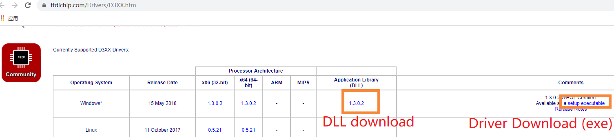
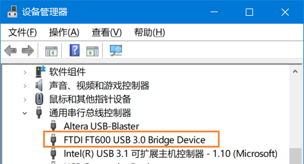

准备 FTD3XX Python 运行环境
====================================

要在 Windows 上运行 FT600 相关的 Python 程序，请进行以下步骤： 

> 注：该文档写于 2019 年，如果之后官网更新，大致流程肯定不变，但一些操作细节（例如官网上找不到下载文件了）就要变通变通了。

### 步骤1：准备 D3XX 驱动 和 DLL

进入 [D3XX Driver 官网页面](https://www.ftdichip.com/Drivers/D3XX.htm) ，在 D3XX Drivers 那一栏的表格里。下载exe形式的驱动并安装。如下图。



同时，下载 DLL 压缩包（如上图）， 解压后在里面找到符合你计算机的 FTD3XX.DLL 文件（若为32-bit计算机，请找到32-bit(win32) DLL；若为64-bit计算机，请找到64-bit(x64) DLL）

### 步骤2：验证驱动安装

将开发板的 FT600 USB 口插入电脑，如果成功安装了驱动，则 **Windows设备管理器** 里应该识别出 **FTDI FT600 USB 3.0 Bridge Device** 。



### 步骤3：安装 python3

我使用的是 **Python 3.5.2|Anaconda 4.2.0 (64-bit)** 。如果你没有安装 Python3， 请前往 [Anaconda官网](https://www.anaconda.com/products/individual) 下载安装 Python3 ，版本号不一定要完全一样（我也不知道别的版本号会不会有问题，更新的版本大概率不会有问题，试试就知道了）。

注意：如果你的计算机是 32-bit，请安装 32-bit 的 Python3，如果你的计算机是 64-bit，请安装 64-bit 的 Python3。

### 步骤4：安装 Python ftd3xx 库

这一步似乎没有办法用 **pip install** 。请打开 [FTDI FT60X 软件示例](http://www.ftdichip.cn/Support/SoftwareExamples/FT60X.htm) 网页， 网页最下方有 Python 的支持。下载后解压，在里面找到 **setup.py** ， 运行CMD命令 **python setup.py install** 安装。 


### 步骤5：复制 FTD3XX.DLL 文件到 Python 环境中

复制 **步骤1** 中我们找到的 **FTD3XX.DLL 文件** 到 Python 根目录。例如在我的电脑上， Python 根目录是 **C:\\Anaconda3\\**

然后，可以运行以下 python 语句来验证安装：

```
import ftd3xx
```

至此，FT600 所需的 Python 运行环境已就绪。
